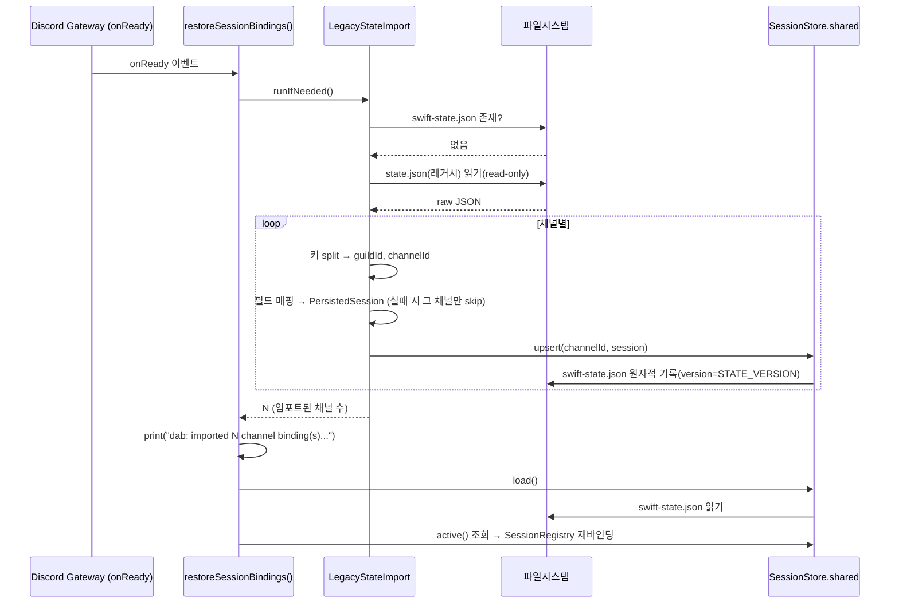
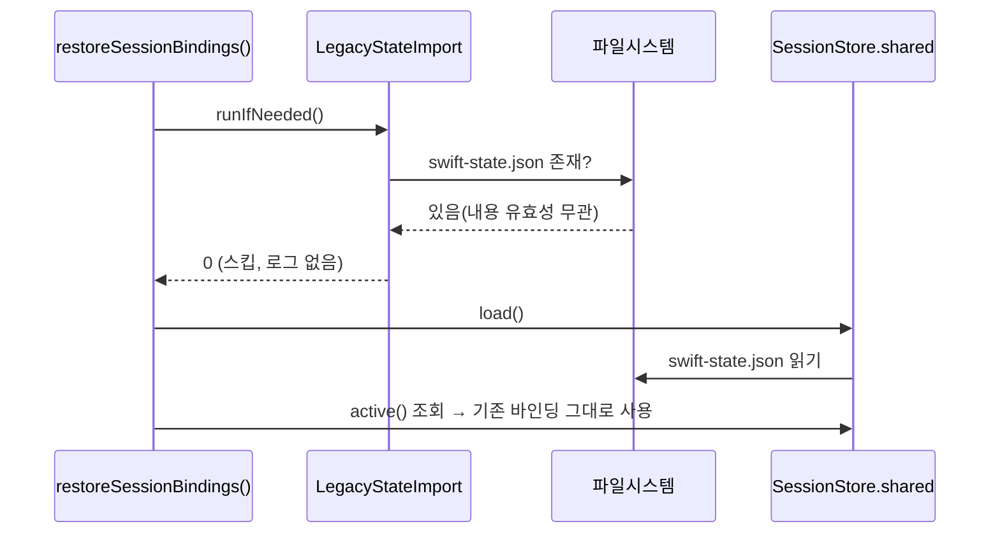

# TS→Swift 레거시 세션 상태 자동 마이그레이션 — 신규 개발

> 상태: `검증중` · 갱신: 2026-07-26 · 브랜치: `plan/swift-port` · 다음 액션: WO-1~WO-3 전부 완료(Medium 이슈 해소) — 남은 것은 7-2 사람 검증(사용자 수행)뿐. `verify.sh`/전체 `swift test`는 이 환경에서 `.build` 인덱서 락으로 비현실적으로 느려 생략(README.md:255-259 기존 이슈) — 사용자가 별도 환경에서 실행 요망.
> 상태 단계(고정): `요구사항` → `설계` → `승인대기` → `구현중` → `검증중` → `완료`
> ⚠️ 본문의 file:line은 드리프트할 수 있음 — 실행 전 반드시 심볼명으로 재확인할 것

---

## 0. 문서 규칙 (에이전트 필독)

이 문서는 여러 세션/서브에이전트가 이어서 작업하기 위한 단일 진실 소스(SSOT)다.

1. **in-place vs append**: 1~8장은 항상 최신 상태로 덮어쓴다. 구버전 결론을 본문에 남기지 않는다. 이력은 10장 「작업 로그」에만 append 한다.
2. **증거 필수**: 기존 코드에 대한 서술에는 반드시 증거(file:line + 심볼명, 커밋 해시)를 병기한다.
3. **스코프 준수**: 2장 Out(비목표)에 걸리는 작업은 수행 금지. 필요해 보이면 9장에 올리고 해당 작업은 중단한다. (스코프 크리프 방지)
4. **상태 단계**: 헤더의 상태는 위 고정 단계만 사용한다. 전환 조건은 각 장 인용문에 명시되어 있다.
5. **승인 게이트**: `승인대기`에서 사용자 승인 전에는 Part B 작성·구현 착수 금지.
6. **경계 분리**: 프로세스/모듈 경계를 넘는 변경은 양쪽 끝을 각각 별도 WO로 쪼갠다.
7. **다이어그램 동기화**: WO 완료로 구조/흐름이 바뀌면 3장의 다이어그램을 함께 갱신한다. 코드와 어긋난 다이어그램을 남기지 않는다.
8. **세션 종료 절차**: ① 헤더(상태·갱신일·다음 액션) 갱신 → ② WO 상태 갱신 → ③ 작업 로그 1항목 append.
9. **독자 구분**: Part A(1~4장)는 **사람**이 읽는다 — 결론 중심으로 간결하게. Part B(5~8장)는 **AI(DEV 서브에이전트)**가 읽는다 — 이 문서 외에 아무것도 재탐색하지 않고 실행 가능한 밀도로 최대한 구체적으로 쓴다.
10. **임의 결정 금지**: 사용자 판단이 필요한 사항은 9장에 올리고, 해당 부분 작업은 중단한다.
11. **검증 이원화**: 7-1(에이전트 검증)은 문서에 적는 것으로 끝내지 않는다 — 반드시 실제 실행하고 결과를 병기한 뒤 체크한다. 7-2(사람 검증)는 에이전트가 절대 체크하지 않는다. 7-1의 수행 주체는 해당 WO를 구현한 에이전트가 아닌 별도 에이전트로 한다. (자기 채점 금지)
12. **[미확인] 마커**: 애매하거나 근거가 부족한 서술은 지어내지 말고 그 자리에 `[미확인: 질문]`을 남긴다. 마커는 9장으로 옮겨 해소하며, `승인대기` 진입 시 본문에 마커가 0개여야 한다.
13. **1회 1WO**: 루프/서브에이전트는 1회 실행에 WO 하나만 집어 완료(또는 블록 기록)하고 종료한다. 여러 WO를 한 번에 처리하지 않는다.

---

# Part A — 요구사항·설계 (사람 확인용)

## 1. 요구사항

- **출처**: 사용자 요청(대화, 2026-07-26) — "TS 레거시가 재시작해도 이어지던 세션이 Swift(`dab`)로 처음 전환하면 전부 끊긴다. 프로그램이 자동으로 인식해서 가져오게 해달라."

### 1-1. 확정 요구사항

| # | 요구사항 | 출처 | 완료 기준 (acceptance) |
|---|---|---|---|
| R1 | Swift(`dab`)가 부팅되어 `restoreSessionBindings()`가 호출될 때, 같은 `DAB_HOME`의 `swift-state.json`이 디스크에 존재하지 않고 레거시 `state.json`이 존재·파싱 가능하면, 레거시의 각 채널 바인딩을 필드 매핑 규칙(3-3 D2)에 따라 변환해 `swift-state.json`에 기록해야 한다. | 사용자 요청 | 임포트 후 `SessionStore.load()` → `active()`가 레거시 채널 수만큼(파싱 성공분) 바인딩을 반환한다. |
| R2 | `swift-state.json`이 이미 디스크에 존재하면(채널 수·유효성 무관), 레거시 임포트를 절대 수행하지 않고 기존 파일을 그대로 둬야 한다. | 사용자 요청("이미 만들어진 바인딩을 임의로 잃으면 안 됨") | 파일이 이미 있는 상태에서 `dab` 재부팅 시 `swift-state.json`의 mtime/내용이 변하지 않는다. |
| R3 | 레거시 `state.json`이 없거나, JSON 파싱에 실패하거나, 개별 채널 항목이 스키마와 맞지 않으면 크래시하지 않아야 한다 — 파일 전체 문제면 임포트를 통째로 건너뛰고, 개별 채널만 문제면 그 채널만 건너뛰고 나머지는 계속 임포트해야 한다. | 사용자 요청("조용히 스킵") + `SessionStore.readFile` 기존 원칙(SessionStore.swift:277-289) | 손상된/일부 필드 누락 legacy 파일로 유닛 테스트 시 크래시 없이 정상 개수만큼만 임포트되거나 0개 임포트로 정상 부팅한다. |
| R4 | 임포트 시 `swift-state.json`의 `version`은 TS `state.json`의 `version` 값을 복사하지 않고 Swift `STATE_VERSION`(SessionStore.swift:9, 현재 2)으로 새로 스탬프해야 한다. | 사용자 요청 | 임포트 후 파일의 `version` 필드가 `STATE_VERSION`과 같다(레거시 파일의 `version` 값과 우연히 같아도 별개로 확인). |
| R5 | 레거시 `state.json`은 어떤 경우에도 읽기 전용으로만 열어야 하고, 수정·삭제해서는 안 된다. | 사용자 요청(TS 런타임이 계속 참조) | 임포트 전/후 레거시 `state.json`의 mtime·내용이 바이트 단위로 동일하다. |
| R6 | 임포트가 실제로 1개 이상의 채널을 가져오면 최소한의 로그(가져온 채널 수)를 표준출력에 남겨야 한다. 스킵된 경우(파일 부재/이미 존재 등)에는 로그를 남기지 않는다. | 사용자 요청 + `restoreSessionBindings()` 기존 로그 관례(DabMain.swift:134) | 임포트 발생 시 `dab: imported N channel binding(s) from legacy state.json` 류의 로그가 정확히 1줄 찍히고, 스킵 시에는 이 로그가 찍히지 않는다. |

### 1-2. 미확정 요구사항 (사용자 확인 필요 → 9장과 연동)

없음 — 조사 결과 사용자가 예시로 든 항목 중 3개(다중 guild 처리, custom 백엔드, sessionId=null 채널)는 기존 코드 근거로 해소되어 3-3 설계결정표에 반영했다. 트리거 정책(1회성 vs 재동기화) 1건만 9장 Q1로 최종 확인을 요청한다.

## 2. 스코프

### In
- Swift 부팅 시(`restoreSessionBindings()` 진입 직전) 레거시 `state.json` → `swift-state.json` **1회성, 읽기 전용** 자동 임포트
- 필드 매핑: `mode→backend`, `sessionId→backendSessionId`, `permissionMode→permMode`, 채널 키의 `guildId:` 접두어 제거, 나머지 동일 필드 그대로 복사(`cwd`/`ownerId`/`model`/`effort`/`permissionProfile`/`projectAuth`/`createdAt`/`updatedAt`/`archived`, `guildId`는 값 안의 필드를 그대로 사용)
- `version` 필드를 Swift `STATE_VERSION`으로 재스탬프
- 안전 가드: 레거시 파일 부재/파싱 실패/개별 채널 스키마 불일치 시 크래시 없이 스킵
- 최소 로그(임포트 발생 시에만, 채널 수)

### Out (명시적 비목표 — 루프의 스코프 크리프 방지)
- TS `state.json`의 `scheduledCommands`, `presetDrafts` 등 다른 top-level 필드 이전 — Swift에 대응 저장소가 없다(`scheduledCommands`는 Swift에 아예 이식되지 않았고, Swift의 `PresetDraft`는 `ChannelWizard.swift`/`ConfigSchema.swift:263`에 정의된 **인메모리 전용** 구조체로 `swift-state.json`에 저장되지 않는다 — 근거: `StoreFile`에 `presetDrafts` 필드 없음, SessionStore.swift:113-117).
- 레거시 `state.json` 자체의 수정·삭제·백업(항상 read-only)
- Swift → TS 역방향 동기화(반대 방향 변환은 요구사항에 없음)
- **지속적 재동기화** — 1회성만 지원한다. TS 프로세스가 이후로도 계속 `state.json`을 갱신하며 Swift와 병행 운영되는 시나리오는 대상이 아니다(사용자의 동기는 "TS→Swift **전환**"이며, 두 런타임이 같은 채널을 동시에 관리하는 것은 가정하지 않는다).
- 마이그레이션 결과를 알리는 Discord 커맨드/알림(예: "/agent migrate-status") — 요청에 없음, YAGNI
- 임포트를 끄는 별도 설정 플래그(예: `DAB_SKIP_LEGACY_IMPORT`) 신설 — R2 자체가 "swift-state.json을 미리 빈 파일로 만들어두면 임포트가 스킵된다"는 자연스러운 opt-out 경로를 이미 제공하므로 별도 플래그는 불필요(YAGNI, 3-3 D1 참고).

## 3. 설계

### 3-1. 클래스 다이어그램

```mermaid
classDiagram
    class LegacyStateImport {
        <<enum, static 전용 네임스페이스>>
        +runIfNeeded(legacyFileURL: URL, swiftFileURL: URL, store: SessionStore) Int
        -defaultLegacyFileURL() URL
        -parseChannels(raw: Any) [(guildId, channelId, PersistedSession)]
    }
    class SessionStore {
        <<modified>>
        +defaultFileURL() URL
        +upsert(channelId: String, PersistedSession) throws
        +load()
        +active() [String: PersistedSession]
    }
    class PersistedSession {
        +backend: Backend
        +backendSessionId: String?
        +cwd: String
        +guildId: String
        +static backend(fromMode: String) Backend
    }
    LegacyStateImport ..> SessionStore : 파일 경로(defaultFileURL) 조회 + upsert() 재사용
    LegacyStateImport ..> PersistedSession : backend(fromMode:) 재사용해 생성
```

- `SessionStore`에는 `defaultFileURL()`의 접근제어자 변경(`private` → 기본/internal) 외에 변경 없음 — 새 public API를 추가하지 않는다(3-5 참고).
- `LegacyStateImport`는 상태를 갖지 않는 static 네임스페이스로, `DiscordText`(DiscordText.swift:5), `I18n`(I18n.swift:13) 등 기존 static-only `enum` 관례를 그대로 따른다.

### 3-2. 시퀀스 다이어그램

**시나리오 1: 최초 부팅 — 레거시 있음, `swift-state.json` 없음 → 정상 임포트**



**시나리오 2: `swift-state.json`이 이미 존재 — 스킵(안전 가드, R2)**



### 3-3. 설계 결정 표

| # | 항목 | 채택안 | 근거 | 폐기 대안 + 폐기 이유 |
|---|---|---|---|---|
| D1 | 트리거 조건 | `swift-state.json`이 디스크에 **전혀 존재하지 않을 때만**(내용 유효성 무관) 레거시 `state.json` 존재 여부를 확인해 1회성으로 임포트 | 사용자가 명시한 "이미 존재하면 절대 재마이그레이션 금지"라는 하드 요구를 만족하는 가장 단순·안전한 게이트. `SessionStore.load()`(SessionStore.swift:196-201)는 파일이 없을 때와 파싱 성공 후 `channels`가 0개일 때를 구분할 방법이 없으므로, 게이트를 파일 존재 여부(FileManager 직접 체크)로만 판단해야 "정상적으로 채널을 다 정리해 0개가 된 상태"와 "최초 미존재 상태"가 혼동되지 않는다. | (a) "channels가 비어있으면"도 트리거 조건에 포함 — 폐기 이유: 사용자가 채널을 모두 archive/remove해 정상적으로 0개가 된 경우와 최초 상태를 구분 불가능해, 매 부팅마다 원치 않는 재임포트가 반복될 위험(9장 Q1로 최종 확인 요청). (b) 매 부팅마다 최신 스냅샷으로 재동기화 — 폐기 이유: 사용자의 하드 요구("절대 덮어쓰거나 재마이그레이션 안 됨")와 정면 충돌, Swift 쪽에서 이미 만든 변경사항을 잃을 위험. |
| D2 | 필드 매핑 | `mode→backend`(기존 `PersistedSession.backend(fromMode:)` 재사용, SessionStore.swift:100-108), `sessionId→backendSessionId`, `permissionMode→permMode`, 채널 키는 첫 `:` 기준 split(TS `splitKey`, channelRegistry.ts:181-185과 동일 규칙)해 `channelId`만 사용하고 `guildId`는 값 안의 `guildId` 필드(TS도 값 안에 guildId를 중복 보유 — schema.ts:27, channelRegistry.ts:83)를 그대로 사용. `cwd`/`ownerId`/`model`/`effort`/`permissionProfile`/`projectAuth`/`createdAt`/`updatedAt`/`archived`는 동일 이름으로 직접 복사(`ProjectAuth` 구조체도 `allowedRoleIds`/`allowedUserIds` 필드가 TS·Swift 완전히 동일 — Authorizer.swift:79-87 vs schema.ts:46-51). | TS `channelBindingSchema`(schema.ts:26-55)와 Swift `PersistedSession`(SessionStore.swift:12-98)의 필드가 이름만 다를 뿐 1:1 대응함을 직접 코드 대조로 확인. **다중 guild**: Swift 채널 키는 channelId 단독이고 guild 필터링 개념이 없다(SessionRegistry.swift 전체에 guild allowlist 없음, `onGuildCreate`가 초대된 모든 guild를 자동 프로비저닝 — DabMain.swift:113-120) → guild 구분 없이 레거시의 모든 채널을 그대로 가져오면 된다(별도 처리 불필요). **custom 백엔드**: `Backend.custom`은 다른 케이스와 동일한 필드만 쓰고 채널 바인딩에 별도 데이터가 없다(SessionLifecycle.swift:292,339 등에서 `.claude`와 동일 경로를 탐) → 특별 처리 불필요. **sessionId=null 채널**: `restoreSessionBindings()`가 이미 `backendSessionId`의 nil 여부를 검사하지 않고 무조건 `SessionRegistry.bind()`한다(DabMain.swift:128-133) → "바인딩은 있지만 이어갈 세션이 없는" 상태를 이미 1급으로 지원 중이므로 그대로 가져오면 된다(각 백엔드 브리지가 `backendSessionId` nil이면 알아서 새 세션을 시작 — DabSessionBridge.swift:319-321 등). | 없음(3개 항목 모두 코드 근거로 특별 처리가 불필요함이 확인되어 별도 대안 검토 불요). |
| D3 | 버전 처리 | 임포트 대상 채널들을 `SessionStore.shared.upsert(channelId:_:)`로 하나씩 기록 — `upsert`가 내부적으로 항상 `StoreFile(version: STATE_VERSION, ...)`로 쓰기 때문에(SessionStore.swift:270) TS의 `version` 값은 아예 읽지도 복사하지도 않는다. | 새 write 경로를 만들지 않고 기존 actor API를 재사용하면 R4가 별도 코드 없이 공짜로 만족된다. | 직접 `StoreFile`을 구성해 파일에 쓰기 — 폐기 이유: atomic write/0600 권한/디렉토리 생성 로직(SessionStore.swift:291-304)을 중복 구현하게 됨. |
| D4 | 원본 보존 | 레거시 파일은 `Data(contentsOf:)`로만 열고, `LegacyStateImport`에는 write 관련 API를 아예 두지 않는다(구조적으로 원본 수정 불가). | R5. | — |
| D5 | 안전성 | 레거시 JSON 파싱은 `SessionStore.readFile`(SessionStore.swift:277-289)과 동일한 "`try?` 실패 시 nil, throw 안 함" 패턴을 적용. 파일 전체가 깨졌으면 임포트 전체를 스킵(0건). 개별 채널 항목은 필수 필드(`guildId`/`mode`/`sessionId`/`cwd`/`ownerId`/`permissionMode`/`createdAt`/`updatedAt`/`archived`) 중 타입이 안 맞는 게 있으면 그 채널 하나만 건너뛰고 나머지는 계속 진행. | TS 쪽이 "미등록 mode 하나 때문에 전체 레코드가 깨지지 않게" 하는 것과 동일 원칙(schema.ts:28-32 주석: "a single unknown value no longer makes appStateSchema.parse reject the WHOLE channels record")을 미러링. | — |
| D6 | 구현 위치 | 별도 모듈 `swift/Sources/DiscordAgentBridge/Session/LegacyStateImport.swift` 신설. `restoreSessionBindings()`(DabMain.swift:125-135)에서 `SessionStore.shared.load()` 호출 **직전**에 1회 호출. | `migrateState`/`migrateStateStep`(SessionStore.swift:119-153)은 "**같은 파일 포맷**(swift-state.json) 안에서 버전이 오름차순으로 하나씩 진행"한다는 불변식(`migrationDidNotAdvance` 체크, SessionStore.swift:147-149)을 가진 순번 마이그레이션이다. 이번 요구사항은 "**다른 프로그램·다른 스키마**(state.json, `guildId:channelId` 합성 키)의 파일을 1회성으로 읽어와 크로스포맷 변환"하는 것으로 성격이 다르다 — 같은 함수에 억지로 얹으면 SRP가 깨지고, 진입 조건(파일 존재 자체가 다름)도 다르다. 별도 모듈이 SessionStore의 책임(자기 파일의 로드/저장/버전 마이그레이션)과 "레거시 프로그램 파일을 읽는 책임"의 응집도를 지킨다. | `readFile()`/`migrateState()` 파이프라인에 "fromVersion 0" 같은 특수 케이스로 위장해 끼워넣기 — 폐기 이유: 위 근거와 동일(SRP 위반, 진입조건 상이). |
| D7 | 테스트 가능성 | `runIfNeeded(legacyFileURL:swiftFileURL:store:)`가 세 값 모두 파라미터로 주입 가능(기본값은 실제 DAB_HOME 기반 경로 + `.shared`) — `SessionStore(fileURL:)`(SessionStore.swift:178-180)와 동일한 DI 패턴. 테스트는 `SessionStoreTests.swift:5-9`의 `tempStoreURL()` 패턴을 그대로 재사용해 legacy/swift 양쪽 임시 파일을 격리. | 기존 테스트 패턴 재사용, 새 테스트 인프라 불필요. | — |
| D8 | 로그/가시성 | 임포트가 1건 이상 발생했을 때만 `print("dab: imported N channel binding(s) from legacy state.json")` 1줄 출력. 스킵된 경우(파일 없음/이미 swift-state.json 존재/전체 파싱 실패)는 로그 없음. | `restoreSessionBindings()`의 기존 관례(`print("dab: restored \(active.count) session binding(s) from store")`, DabMain.swift:134)와 동일한 스타일. 매 부팅 스킵마다 로그가 찍히면(=거의 항상 스킵) 노이즈가 된다. | — |

### 3-4. 경계 영향

- 프로세스 간 통신: 아니오 — 전부 `dab` 단일 프로세스 내부, 부팅 시퀀스 도중 실행. TS 프로세스와의 IPC 없음(파일시스템을 통한 단방향 읽기만 존재, TS 프로세스가 그 시점에 실행 중인지 여부와 무관하게 안전 — 파일을 읽기만 하므로).
- 공통 모듈: 예 — `SessionStore`(`defaultFileURL()` 가시성 변경 + `upsert()` 재사용), `PersistedSession`/`Backend`(SessionRegistry.swift, SessionStore.swift).
- 공유 데이터 모델: 예 — 레거시 `state.json`(TS `channelBindingSchema`, 읽기 전용 입력)과 `swift-state.json`(`PersistedSession`, 쓰기 대상) 두 스키마 간 1회성 변환.

### 3-5. 기존 구조 변경 영향 (SessionStore 접근제어자 변경)

이 기능은 새 파일 1개 추가가 대부분이지만, `LegacyStateImport`가 `SessionStore.shared`가 실제로 사용할 `swift-state.json` 경로를 **정확히 동일하게**(별도로 재계산하지 않고) 알아야 게이트 체크(D1)가 어긋나지 않으므로, `SessionStore` 기존 심볼 1개의 접근제어자를 변경한다.

- **As-is**: `SessionStore.swift:182` `private static func defaultFileURL() -> URL`은 `SessionStore` 액터 본문 내부(같은 파일)에서만 접근 가능. `restoreSessionBindings()`(DabMain.swift:125-135)는 `SessionStore.shared.load()`를 바로 호출.
- **To-be**: `defaultFileURL()`의 `private` 키워드를 제거해(기본 접근제어자 = internal, 모듈 내 공개) `LegacyStateImport.swift`가 동일 URL을 재계산 없이 참조. `restoreSessionBindings()`는 `SessionStore.shared.load()` 호출 직전에 `await LegacyStateImport.runIfNeeded()` 1줄을 추가.
- **영향 범위**:
  - `swift/Sources/DiscordAgentBridge/Session/SessionStore.swift:182` — 접근제어자 1곳 변경(동작 변경 없음, 가시성만 완화). 함수 시그니처/반환값/부작용 전부 동일.
  - `swift/Sources/dab/DabMain.swift:125-135` `restoreSessionBindings()` — 1줄 추가.
  - 신규: `swift/Sources/DiscordAgentBridge/Session/LegacyStateImport.swift`.
  - 신규 테스트: `swift/Tests/DiscordAgentBridgeTests/LegacyStateImportTests.swift`(제안).
  - `SessionStore`의 기존 public API(`upsert`/`load`/`active`/`binding` 등)는 시그니처 변경 없음 — `DabSessionBridge`/`CodexSessionBridge`/`GrokSessionBridge`/`ConfigResolver.SessionStoreBindingSource` 등 기존 호출자에 영향 없음(impact-analysis 관점에서 이 심볼들을 직접 건드리지 않음).
- **마이그레이션 단계**:
  1. `SessionStore.defaultFileURL()` 접근제어자 완화(순수 가시성 변경, 동작 회귀 리스크 없음).
  2. `LegacyStateImport.swift` 신규 작성(게이트 → 파싱 → 필드 매핑 → `upsert` 루프 → 로그).
  3. `DabMain.swift`의 `restoreSessionBindings()`에 호출 1줄 삽입.
  4. 유닛 테스트 작성: 정상 임포트 / 이미 `swift-state.json` 존재 시 스킵 / 레거시 파일 손상 시 스킵 / 개별 채널 파싱 실패 시 나머지 채널은 계속 임포트.
  5. 사람 검증(7-2로 승격 예정): 이 머신의 실제 `~/.discord-agent-bridge/state.json`(7채널, 1 guild, 전부 `claude` 백엔드 — 2026-07-26 확인)을 **복사본**으로 별도 임시 `DAB_HOME`에 두고 `dab`을 1회 부팅해 `swift-state.json`에 7개 채널이 기대 필드로 생성되는지 확인. 실제 운영 `DAB_HOME`에서는 절대 검증하지 않는다(실 데이터 오염 방지).
- **롤백 계획**: 이 기능은 **`swift-state.json`이 아직 없을 때만** 동작하므로, 문제가 생기면 (a) 새로 생성된 `swift-state.json`을 삭제하고 (b) `restoreSessionBindings()`에 추가한 호출 1줄을 되돌리면 즉시 기존 동작(레거시 무시하고 빈 상태로 부팅)으로 복귀한다. 레거시 `state.json`은 read-only로만 다뤘으므로 롤백 시에도 원본 손상 리스크가 없다. `defaultFileURL()` 가시성 완화는 순수 추가적 변경이라 되돌려도 기존 기능에 영향 없다.

## 4. 참조 패턴 (기존 구현 미러링 지정)

| 만들 것 | 미러링할 기존 구현 (절대경로 + 심볼) | 따라야 할 점 |
|---|---|---|
| `LegacyStateImport`의 DI 가능한 파일 경로 주입 | `/Volumes/SourceCode/Sample/discord-agent-bridge/swift/Sources/DiscordAgentBridge/Session/SessionStore.swift:178-192` `init(fileURL:)` + `defaultFileURL()` | 파라미터 기본값은 nil이 아니라 실제 DAB_HOME 기반 defaultURL로 채워 넣고(테스트는 명시적 URL 주입) `swiftFileURL`/`store`가 항상 같은 파일을 가리키도록 호출자가 보장 |
| 레거시 파일 안전 파싱(실패 시 nil, throw 안 함) | 위 파일 `:277-289` `readFile(_:)` | `JSONSerialization` → `try?` 패턴, 파일 전체 문제는 nil로 스킵 |
| DAB_HOME 기반 기본 경로 해석 | 위 파일 `:182-192`, `Config/ConfigStore.swift:30-40`, `Session/AuditLog.swift:90-100`, `Render/ChromiumProvisioner.swift:128-140` | 각 스토어가 독립적으로 `env DAB_HOME > ~/.discord-agent-bridge/`를 재구현하는 기존 컨벤션을 그대로 따름(공용 헬퍼로 추출하지 않는다 — 4곳이 이미 각자 구현 중) |
| `mode`→`backend` 변환 | 위 파일 `:100-108` `PersistedSession.backend(fromMode:)` | 그대로 재사용, 별도 매핑 테이블 새로 만들지 않음 |
| 채널별 원자적 upsert | 위 파일 `:234-242` `upsert(channelId:_:)` | 신규 write 경로를 만들지 않고 기존 actor API 재사용 — `STATE_VERSION` 스탬프/atomic write(tmp+rename)/0600 권한을 그대로 상속 |
| 부팅 시 1회 호출 지점 | `/Volumes/SourceCode/Sample/discord-agent-bridge/swift/Sources/dab/DabMain.swift:125-135` `restoreSessionBindings()` | `SessionStore.shared.load()` 호출 "직전"에 삽입, 기존 로그 스타일(`print("dab: ...")`) 유지 |
| static 전용 네임스페이스 형태 | `/Volumes/SourceCode/Sample/discord-agent-bridge/swift/Sources/DiscordAgentBridge/I18n.swift:13` `enum I18n`, `DiscordText.swift:5` `enum DiscordText` | `public enum LegacyStateImport { ... }` — case 없이 static 함수만 담는 기존 관례 |
| 테스트 파일 경로 주입 패턴 | `/Volumes/SourceCode/Sample/discord-agent-bridge/swift/Tests/DiscordAgentBridgeTests/SessionStoreTests.swift:5-9` `tempStoreURL()` | 동일하게 legacy 파일용 임시 URL도 temp 디렉토리에 생성해 테스트 격리 |

> **`승인대기`**: Part A 완성 후 사용자 승인을 받는 게이트. 승인 결과와 코멘트는 10장 작업 로그에 기록. 승인 후 `구현중`으로 전환하고 Part B를 작성한다.

---

# Part B — 작업 지시 (AI 실행용)

## 5. 구현 계획 (Phase)

| Phase | 목적 | 포함 WO | 완료 판정 |
|---|---|---|---|
| 1 | `LegacyStateImport` 구현 + 부팅 연동 | WO-1 | `swift build --package-path swift` 성공 |
| 2 | 유닛 테스트 | WO-2 | `swift test --package-path swift` 성공, R1~R6 전부 테스트로 커버 |

## 6. 작업 지시서 (Work Orders)

### WO-1: LegacyStateImport 모듈 신설 + SessionStore 접근제어자 완화 + 부팅 연동
- 상태: [x] 완료
- 의존: 없음
- 충족: R1, R2, R3, R4, R5, R6
- 대상:
  - `swift/Sources/DiscordAgentBridge/Session/SessionStore.swift:182` `private static func defaultFileURL() -> URL`
  - 신규: `swift/Sources/DiscordAgentBridge/Session/LegacyStateImport.swift`
  - `swift/Sources/dab/DabMain.swift:125-135` `restoreSessionBindings()`
- 변경:
  1. `SessionStore.swift:182`의 `defaultFileURL()`에서 `private` 키워드만 제거(기본 접근제어자로 완화). 시그니처/반환값/부작용 변경 없음.
  2. `LegacyStateImport.swift` 신규 작성. `public enum LegacyStateImport { ... }` (case 없는 static 전용 네임스페이스 — `I18n.swift:13`, `DiscordText.swift:5` 관례 그대로 미러링).
     - `public static func runIfNeeded(legacyFileURL: URL = defaultLegacyFileURL(), swiftFileURL: URL = SessionStore.defaultFileURL(), store: SessionStore = .shared) async -> Int` — 반환값은 임포트된 채널 수(스킵 시 0).
     - 게이트(D1, Q1 확정): `FileManager.default.fileExists(atPath: swiftFileURL.path)`가 `true`면 즉시 `return 0`(로그 없음). `false`일 때만 다음 단계 진행.
     - 레거시 파일 읽기: `Data(contentsOf: legacyFileURL)` → 실패(파일 없음/권한 등)면 `return 0`(로그 없음). `JSONSerialization.jsonObject(with:)`로 `[String: Any]` 파싱 실패(`try?` 사용, throw 금지)도 `return 0`.
     - `raw["channels"] as? [String: [String: Any]]`가 nil이면 `return 0`.
     - 각 채널 항목(`key`, `binding`)을 순회:
       - `key`를 첫 `:` 기준으로 split — `guildIdPart`, `channelIdPart`. 콜론이 없으면(포맷 불일치) 그 항목 skip.
       - `binding`에서 `mode`(String), `sessionId`(String?), `cwd`(String), `ownerId`(String?), `permissionMode`(String?), `permissionProfile`(String?), `projectAuth`(있으면 그대로 디코드), `createdAt`(String?), `updatedAt`(String), `archived`(Bool, 없으면 false)를 읽는다. **필수 필드**(`cwd`, `updatedAt`) 타입이 안 맞으면 그 채널만 skip하고 계속 진행 — 절대 throw 하지 않는다.
       - `guildId`는 `binding["guildId"] as? String`을 우선 사용(레거시 값 안의 필드), 없으면 키에서 split한 `guildIdPart`로 폴백.
       - `PersistedSession(backend: PersistedSession.backend(fromMode: mode), backendSessionId: sessionId, cwd: cwd, guildId: guildId, ownerId: ownerId, model: binding["model"] as? String, effort: binding["effort"] as? String, permMode: permissionMode, permissionProfile: permissionProfile, projectAuth: ..., createdAt: createdAt, updatedAt: updatedAt, archived: archived)` 구성 후 `try? await store.upsert(channelId: channelIdPart, session)` — 실패해도 다음 채널 계속.
     - 성공적으로 upsert된 채널 수를 카운트해 반환.
     - `defaultLegacyFileURL()`: `SessionStore.swift:182-192`와 동일한 `DAB_HOME` 우선 규칙으로 `state.json` 경로 계산(별도 헬퍼로 추출하지 않고 그대로 재구현 — 4장 참조 패턴 "DAB_HOME 기반 기본 경로 해석" 관례).
  3. `DabMain.swift:125-135` `restoreSessionBindings()` 맨 앞, `await SessionStore.shared.load()` 호출 **직전**에 다음 삽입:
     ```swift
     let imported = await LegacyStateImport.runIfNeeded()
     if imported > 0 {
         print("dab: imported \(imported) channel binding(s) from legacy state.json")
     }
     ```
- 금지:
  - `SessionStore`의 기존 public API(`upsert`/`load`/`active`/`binding`/`remove`/`markArchived`) 시그니처 변경 금지.
  - `migrateState`/`migrateStateStep`(SessionStore.swift:119-153)에 로직을 얹지 않는다(D6, SRP 분리 유지).
  - 레거시 `state.json`을 여는 코드 경로에 write/delete API를 두지 않는다(D4, R5).
  - `swift-state.json`이 이미 존재할 때 파일 내용을 읽거나 파싱을 시도하지 않는다(존재 여부 체크만으로 즉시 반환 — 손상된 기존 파일 때문에 에러가 나면 안 됨).
- 완료 판정: `swift build --package-path swift` 성공 + `rg "LegacyStateImport" swift/Sources` 3곳 이상 검출(정의 + DabMain 호출 + SessionStore 접근 참조).

### WO-2: LegacyStateImportTests 유닛 테스트
- 상태: [x] 완료
- 의존: WO-1 완료 후
- 충족: R1, R2, R3, R4, R5, R6 (테스트로 검증)
- 대상: 신규 `swift/Tests/DiscordAgentBridgeTests/LegacyStateImportTests.swift`
- 변경: `SessionStoreTests.swift:5-9`의 `tempStoreURL()` 임시 파일 패턴을 그대로 재사용해 legacy/swift 양쪽 임시 URL을 만들고, 아래 케이스를 작성:
  1. **정상 임포트(R1, R4)**: 레거시 JSON에 `guildId:channelId` 키 2~3개(하나는 `sessionId` 존재, 하나는 `null`, `mode` 값은 `claude`/`codex` 등 다양하게)를 담은 임시 `state.json` 작성 → `swiftFileURL`은 미존재 → `runIfNeeded()` 호출 → 반환값이 채널 수와 일치 + `SessionStore(fileURL: swiftFileURL).load()` 후 `active()`로 `backend`/`backendSessionId`/`cwd`/`guildId`가 기대값과 일치 + 기록된 파일의 최상위 `version`이 `STATE_VERSION`과 같음(레거시 파일의 `version` 값과 다르게 설정해 구분 확인).
  2. **이미 존재 시 스킵(R2)**: `swiftFileURL`에 미리 파일(빈 `channels`도 포함해서 테스트)을 만들어두고 `runIfNeeded()` 호출 → 반환값 0 + 그 파일의 내용이 호출 전후로 완전히 동일(바이트 비교 또는 diff 없음).
  3. **레거시 파일 부재/손상 시 스킵(R3)**: (a) `legacyFileURL`이 아예 없는 경우, (b) 유효하지 않은 JSON인 경우 각각 `runIfNeeded()`가 크래시 없이 0 반환.
  4. **개별 채널 파싱 실패(R3)**: 레거시 JSON의 채널 3개 중 1개는 `cwd` 필드가 없거나 타입이 틀림 → `runIfNeeded()` 반환값이 2(나머지 정상 채널만 임포트됨), 크래시 없음.
  5. **원본 보존(R5)**: 임포트 전후로 `legacyFileURL`의 파일 내용(바이트) 및 mtime이 변경되지 않음.
  6. **로그(R6)**: 이 항목은 유닛 테스트로 표준출력을 캡처하기보다 WO-1 코드 리뷰로 확인(표준출력 캡처는 기존 테스트 관례에 없음) — 7-1에서 코드 리뷰로 대체 확인.
- 금지: 실제 운영 `~/.discord-agent-bridge/`를 테스트에서 참조하지 않는다(항상 임시 디렉토리 사용).
- 완료 판정: `swift test --package-path swift --filter LegacyStateImportTests` 전부 통과.

### WO-3: 개별 채널 캐스팅 격리 수정 (RV Medium 이슈) + 누락 테스트 추가
- 상태: [x] 완료
- 의존: WO-1, WO-2 완료 후
- 충족: R3 (개별 채널 파싱 실패가 파일 전체를 스킵시키지 않아야 한다는 요구사항의 실제 준수)
- 대상: `swift/Sources/DiscordAgentBridge/Session/LegacyStateImport.swift:29`, `swift/Tests/DiscordAgentBridgeTests/LegacyStateImportTests.swift`
- 배경(RV 리뷰 발견, 10장 참고): `guard let channels = raw["channels"] as? [String: [String: Any]] else { return 0 }`는 채널 값 하나라도 딕셔너리가 아니면(문자열/배열/null 등) 캐스팅 전체가 실패해 **모든** 채널이 스킵된다. R3 문언("개별 채널만 문제면 그 채널만 건너뛰고 나머지는 계속 임포트")과 어긋난다.
- 변경:
  1. `LegacyStateImport.swift:29`를 얕은 캐스팅으로 바꾸고, 채널별 캐스팅 실패는 그 채널만 skip:
     ```swift
     guard let channels = raw["channels"] as? [String: Any] else { return 0 }
     var imported = 0
     for (key, rawBinding) in channels {
         guard let binding = rawBinding as? [String: Any] else { continue }
         // ... 이하 기존 로직(키 split → parseSession → upsert) 그대로, binding만 교체
     }
     ```
  2. `LegacyStateImportTests.swift`에 케이스 추가: 채널 3개 중 1개의 값이 딕셔너리가 아닌 경우(예: 문자열 또는 배열) → 나머지 2개는 정상 임포트되고 반환값이 2인지 확인. 기존 "개별 채널 파싱 실패" 테스트(`skipsOnlyBadChannelKeepsOthers`)와는 별개 케이스로 추가(그 테스트는 `cwd` 누락 케이스라 이번 케이스와 다름).
- 금지: 그 외 파일/로직 변경 금지(범위 최소화). 문서 3-3 D5 문구 정합성 등 Low 이슈 3건은 이번 WO 범위 밖 — 건드리지 않는다.
- 완료 판정: `swift build --package-path swift` 성공 + `swift test --package-path swift --filter LegacyStateImportTests` 전부 통과(신규 케이스 포함 7개).

## 7. 검증 계획

### 7-1. 에이전트 검증 (에이전트가 실제 수행 — WO를 구현한 에이전트가 아닌 별도 에이전트가 수행)

- [x] 빌드: `swift build --package-path swift` 성공 — 결과: `ok (build complete)` (2026-07-26, RV 세션 재확인).
- [x] 테스트: `swift test --package-path swift --filter LegacyStateImportTests` 전부 통과 — 결과: `Test run with 6 tests in 1 suite passed`(6/6, 2026-07-26, RV 세션 재확인).
- [ ] 전체 게이트: `bash verify.sh` 통과 — 결과: **생략** — 이 환경에서 `.build` 인덱서 락으로 비현실적으로 느려(README.md:255-259 기존 이슈, `--scratch-path`로도 10분 이상 미종료 확인) 이번엔 수행하지 않음. 사용자가 별도 환경/시점에 직접 실행 요망.
- [x] 정적 확인: `rg "LegacyStateImport" swift/Sources` 검출 — 결과: 3곳(`LegacyStateImport.swift:9` 정의, `DabMain.swift:126` 호출, `SessionStore.swift:182` 접근제어자 완화 주석).
- [ ] R6 로그 관례 코드 리뷰: `imported > 0`일 때만 `print` 1줄, 스킵 경로에는 로그 없음을 코드로 확인 — 결과: RV가 코드 리뷰로 확인함(`DabMain.swift:126-129` — `if imported > 0`일 때만 1줄 출력, 그 외 분기 없음). 체크박스는 지시에 따라 미표기, 상세는 10장 RV 세션 로그 참고.

### 7-2. 사람 검증 (수동 QA — 사용자 확인 후 기입)

- [ ] R1/R4: 실제 `~/.discord-agent-bridge/state.json`을 **복사본**으로 별도 임시 `DAB_HOME`에 두고 `dab` 1회 부팅 → `swift-state.json`에 7개 채널이 기대 필드(backend=claude, backendSessionId 등)로 생성되는지 확인 (실 운영 DAB_HOME에서는 검증하지 않음)
- [ ] R2: 위에서 생성된 `swift-state.json` 상태로 `dab` 재부팅 → 로그에 "imported" 라인이 찍히지 않고 기존 파일이 그대로인지 확인
- [ ] 실제 디스코드 채널에서 세션ID가 있던 채널(예: Viewer/vapor 프로젝트)에 메시지를 보내 Claude 대화가 실제로 이어지는지 확인

## 8. 주의사항 (누적)

- `/agent close`는 TS·Swift 모두 하드 삭제(`channelRegistry.remove()` / `SessionStore.remove()`)라서 레거시 `state.json`에는 이미 닫힌 채널이 애초에 남아있지 않다 — `LegacyStateImport`가 "닫힌 채널 제외" 같은 별도 필터링을 할 필요가 없다.
- `SessionStore.load()`는 "파일 없음"과 "파일 있음+channels 0개"를 구분하지 못하므로, 트리거 게이트는 반드시 `FileManager.fileExists`로 **파일 자체의 존재 여부**만 봐야 한다(Q1 확정 사항). `SessionStore`의 내부 상태나 `active()`/`all()` 결과로 게이트를 판단하지 않는다.
- 레거시 파일 파싱은 절대 `throw`하지 않는다 — 전체 실패든 개별 채널 실패든 항상 값을 반환(0 또는 부분 카운트)해서 `restoreSessionBindings()`가 어떤 경우에도 계속 진행되게 한다.

---

## 9. 미결 사항 (사용자 결정 필요 — 에이전트 임의 결정 금지)

| # | 질문 | 배경 | 결정 (사용자 기입) |
|---|---|---|---|
| Q1 | 트리거 정책을 "**`swift-state.json` 파일이 디스크에 전혀 없을 때만, 딱 1번**" 임포트하는 것으로 확정해도 되는가? (3-3 D1) | 사용자가 "이미 존재하면 절대 재마이그레이션 금지"라고 명시했고, 동시에 "channels가 비어있을 때"도 예시로 들었다. 그런데 `SessionStore.load()`는 현재 "파일 부재"와 "파일은 있는데 채널 0개"를 구분할 방법이 없어, 두 조건을 동시에 게이트로 쓰면 "정상적으로 채널을 다 정리한 상태"에서 매 부팅마다 원치 않는 재임포트가 반복될 위험이 있다. ARCH 권고안은 "파일 존재 여부만" 보는 것(가장 단순·안전) — 이 권고안으로 확정할지, 다른 정책(예: 명시적 커맨드/플래그로만 수동 트리거)을 원하는지 확인 필요. | **확정(2026-07-26): 1번(ARCH 권고안) — 파일 존재 여부만으로 게이트**. |

## 10. 작업 로그 (append-only)

### 2026-07-26 — ARCH(설계) 세션
- 한 일: 코드베이스 직접 재확인(`SessionStore.swift` load/readFile/migrateState 전체, `DabMain.swift` restoreSessionBindings 호출부, `Backend` enum, TS `schema.ts`/`channelRegistry.ts`/`sessionOrchestrator.ts` resumeAll), 이 머신의 실제 `state.json`(7채널, 1 guild, 전부 claude, sessionId null/non-null 혼재) 및 `swift-state.json`(부재) 확인. `docs/legacy-state-migration.md` Part A(1~4장) 작성.
- 알아낸 것: (1) 다중 guild/커스텀 백엔드/sessionId=null 3개 항목은 기존 코드가 이미 특별 처리 없이 지원하는 구조임을 file:line으로 확인해 9장에서 제외. (2) `SessionStore.upsert()`를 그대로 재사용하면 버전 스탬프·atomic write·0600 권한을 새 코드 없이 상속받을 수 있음. (3) `defaultFileURL()`이 `private`이라 `LegacyStateImport`가 동일 경로를 참조하려면 접근제어자 완화가 유일한 기존 구조 변경 지점.
- 바뀐 결정: 트리거 정책(파일 존재 여부 단독 게이트)은 사용자의 하드 요구에서 도출했지만, 사용자가 명시적으로 예시를 든 축이라 9장 Q1로 최종 확인을 요청하기로 함(임의 결정 금지 원칙 준수).

### 2026-07-26 — DEV(구현) 세션 — WO-1
- 한 일: (1) `SessionStore.swift:182` `defaultFileURL()`에서 `private` 제거(internal로 완화) + 접근제어자 완화 사유 주석 1줄 추가. (2) 신규 `swift/Sources/DiscordAgentBridge/Session/LegacyStateImport.swift` 작성 — `public enum LegacyStateImport`(case 없는 static 전용 네임스페이스, `I18n`/`DiscordText` 관례 미러링), `runIfNeeded(legacyFileURL:swiftFileURL:store:)` + `parseSession(_:guildIdFallback:)` + `defaultLegacyFileURL()` 3개 함수로 구성. (3) `DabMain.swift:126` `restoreSessionBindings()` 맨 앞에 `LegacyStateImport.runIfNeeded()` 호출 + 조건부 로그 3줄 삽입.
- 설계 문서와의 차이(사소한 구현 조정, 범위 내): WO-1 원문(6장, line 227)의 `runIfNeeded(legacyFileURL: URL = defaultLegacyFileURL(), swiftFileURL: URL = SessionStore.defaultFileURL(), ...)` 시그니처는 실제로는 컴파일되지 않았다 — Swift는 `public` 함수의 파라미터 기본값 표현식이 `internal` 심볼을 직접 호출하는 것을 금지한다(cross-module default-argument-value 규칙, `dab` 실행 타깃이 `DiscordAgentBridge` 라이브러리 타깃과 별도 모듈이라 발생). 4장 참조 패턴 표가 이미 지목한 `SessionStore.init(fileURL:)`(SessionStore.swift:178-180, `URL? = nil` 파라미터 + 함수 본문에서 `Self.defaultFileURL()`로 해석)과 동일한 nil-then-resolve 패턴으로 바꿔 해결 — 접근제어자는 문서 3-5 계획대로 `internal`을 그대로 유지했고, `defaultFileURL()`/`defaultLegacyFileURL()`를 `public`으로 올리지는 않았다. 외부에서 관찰되는 동작(인자 없이 호출 시 실제 DAB_HOME 기반 경로로 동작, 테스트 시 명시적 URL 주입 가능)은 원안과 동일.
- 검증: `swift build --package-path swift` → `ok (build complete)`. `rg -n "LegacyStateImport" swift/Sources` → 3곳(정의 1 + DabMain 호출 1 + SessionStore 접근제어자 완화 주석 1).
- 금지사항 준수 확인: `SessionStore` 기존 public API(`upsert`/`load`/`active`/`binding`/`remove`/`markArchived`) 시그니처 무변경. `migrateState`/`migrateStateStep`에 로직 추가 안 함. `LegacyStateImport`에 write/delete API 없음(레거시 파일은 `Data(contentsOf:)`로만 읽음). `swiftFileURL` 존재 시 `FileManager.fileExists` 체크만 하고 파싱 시도 안 함(즉시 `return 0`).
- 이번 실행 범위 밖(다음 세션): WO-2(`LegacyStateImportTests.swift` 유닛 테스트), 7-1 별도 에이전트의 `swift test`/`verify.sh` 전체 검증.

### 2026-07-26 — DEV(구현) 세션 — WO-2
- 한 일: 신규 `swift/Tests/DiscordAgentBridgeTests/LegacyStateImportTests.swift` 작성. 3-옵션 제안(레거시 JSON 픽스처 구성 방식) 제시 후 사용자가 옵션 1(딕셔너리 리터럴 + `JSONSerialization`, `SessionStoreTests.swift` 기존 컨벤션 그대로)을 확정해 그대로 구현. `tempStoreURL()`(swift-state.json용)과 이를 미러링한 `tempLegacyURL()`(state.json용) 2개의 파일 스코프 private 헬퍼로 legacy/swift 양쪽 임시 경로를 격리. 6장 WO-2에 적힌 6개 케이스를 6개 `@Test` 함수로 1:1 구현: `importsLegacyChannelsOnFirstBoot`(R1/R4 — 채널 3개: sessionId 존재/`null`/guildId 필드 부재 시 키 fallback까지 커버, `version`이 legacy의 1에서 `STATE_VERSION`(2)으로 재스탬프되는지 확인), `skipsWhenSwiftStateAlreadyExists`(R2 — 유효한 legacy 파일이 있어도 게이트만으로 무시되는지 증명하기 위해 legacy도 일부러 유효하게 구성, swift-state.json 바이트+mtime 불변 확인), `skipsWhenLegacyFileMissing`/`skipsWhenLegacyFileCorrupt`(R3 — 파일 부재/손상 각각 크래시 없이 0 반환), `skipsOnlyBadChannelKeepsOthers`(R3 — 3채널 중 `cwd` 필드 누락 1개만 skip, 나머지 2개는 계속 임포트), `leavesLegacyFileUntouchedAfterImport`(R5 — 성공적 임포트 전후로도 legacy 파일 바이트+mtime 불변). R6(로그)은 문서 지시대로 유닛 테스트로 캡처하지 않고 WO-1 코드(`DabMain.swift:126-129`) 리뷰로 대체 확인 — `imported > 0`일 때만 `print` 1줄, 스킵 경로(0 반환)에는 어떤 print도 없음을 코드로 확인함.
- 프로덕션 코드 이슈: 발견 없음. 6개 테스트 모두 프로덕션 코드(`LegacyStateImport.swift`/`SessionStore.swift`/`DabMain.swift`) 수정 없이 1회에 통과 — WO-1 구현이 문서 3-3/6장 스펙과 어긋나는 지점을 찾지 못함.
- 검증(본인 수행 — 자기 검증 한정, 7-1 공식 게이트는 별도 에이전트 몫이라 7-1 체크박스는 미기입): `swift test --package-path swift --filter LegacyStateImportTests` → `Test run with 6 tests in 1 suite passed`(6/6 통과). `swift build --package-path swift` → `ok (build complete)`.
- 이번 실행 범위 밖(다음 세션): 7-1 전체 게이트(별도 에이전트가 수행 — `swift test --package-path swift` 전체, `bash verify.sh`, R6 코드리뷰 항목의 공식 체크), 7-2 사람 검증(실제 `state.json` 복사본으로 부팅 검증 등).

### 2026-07-26 — RV(리뷰) 세션
- 한 일: `LegacyStateImport.swift`/`SessionStore.swift`/`DabMain.swift:125-139`/`LegacyStateImportTests.swift` 4개 파일 전체 정독. `Backend`(SessionRegistry.swift:5-10)/`ProjectAuth`(Authorizer.swift:79-87)/`normalizeModeId`(ConfigSchema.swift:13-16)/`SessionStoreTests.swift` 기존 관례 대조 확인. `rg "defaultFileURL\(\)"`로 접근제어자 완화 지점의 호출자 전수 확인(2곳: `SessionStore.init`, `LegacyStateImport.swift:23` — 의도 밖 호출자 없음). 빠른 명령 3개 재실행(빌드/필터 테스트/rg) — 전부 통과.
- 검증 결과 — Critical/High: 없음.
- Medium 1건: **[Medium] `LegacyStateImport.swift:29`** — `raw["channels"] as? [String: [String: Any]]`가 채널 하나의 값이라도 딕셔너리가 아니면(예: 문자열/배열/null) 전체 캐스팅이 실패해 `return 0`으로 **모든** 채널의 임포트가 스킵됨. R3("개별 채널만 문제면 그 채널만 건너뛰고 나머지는 계속 임포트")의 문언과 어긋나는 사례 — 크래시는 없지만(안전하게 0건 반환) 격리 단위가 파일 전체가 되어버림. `SessionStore.swift:128` `migrateStateStep`의 동일 캐스팅 관례를 그대로 미러링한 결과이긴 하나(그쪽도 같은 한계 보유, 기존 코드라 이번 스코프 아님), `LegacyStateImport`는 신규 코드이므로 개별 채널 격리를 원한다면 `raw["channels"] as? [String: Any]`로 얕게 캐스팅한 뒤 루프 안에서 `rawBinding as? [String: Any]`를 채널별로 시도하고 실패 시 `continue`하는 형태로 고치는 편이 R3 문언에 더 부합함. 재현 확률은 낮음(TS가 직접 쓰는 파일은 항상 각 채널이 object) — Medium으로 분류.
  ```swift
  // 수정 방향 예시
  guard let channels = raw["channels"] as? [String: Any] else { return 0 }
  var imported = 0
  for (key, rawBinding) in channels {
      guard let binding = rawBinding as? [String: Any] else { continue }
      ...
  }
  ```
- Low 3건:
  1. **`LegacyStateImportTests.swift`** — 위 Medium과 짝을 이루는 케이스(채널 값 자체가 dict가 아닌 경우, 키에 `:`가 없는 경우)에 대한 테스트가 없음. Medium 수정 시 함께 추가 권장.
  2. **문서 3-3 D5(line 157) vs 6장 WO-1(line 233) 불일치** — D5는 "필수 필드"로 9개(`guildId`/`mode`/`sessionId`/`cwd`/`ownerId`/`permissionMode`/`createdAt`/`updatedAt`/`archived`)를 나열하지만, 실제 WO-1 지시·구현은 `cwd`/`updatedAt` 2개만 타입 불일치 시 스킵 대상으로 좁힘(의도된 축소로 보이나 Part A 문언이 갱신 안 됨 — 향후 읽는 사람이 혼동할 수 있음). D5 문언을 WO-1과 일치하도록 정리 권장.
  3. **`LegacyStateImport.swift:17-21`** — `runIfNeeded(legacyFileURL:swiftFileURL:store:)`의 `swiftFileURL`과 `store`가 동일 파일을 가리켜야 하는 불변식이 설계문서(3-5/4장)에만 있고 함수 자체 주석에는 명시 안 됨. 현재 유일한 프로덕션 호출부(`DabMain.swift:126`, 전부 기본값)는 안전하지만, 추후 누군가 세 인자를 따로 넘기면 게이트가 엉뚱한 파일을 보고 오작동할 수 있음 — 함수 doc-comment에 한 줄 경고 추가 권장.
- Low/참고(수정 불요): `archived` 필드가 legacy에서 Bool이 아닌 타입으로 깨져 있으면 `(binding["archived"] as? Bool) ?? false`가 조용히 `false`(활성)로 되돌림 — WO-1이 의도적으로 `cwd`/`updatedAt`만 필수 필드로 좁힌 설계(위 Low #2)와 일관된 동작이라 버그는 아니나, "레거시에서 이미 archived=true였던 채널이 타입 오류로 되살아날 수 있다"는 점은 기록해 둠.
- 테스트 신뢰성: 6개 케이스 모두 R1~R5를 실질적으로 검증(형식적 assertion 아님) — 특히 R2/R5는 바이트+mtime 비교로 실제로 손대지 않았음을 증명하는 방식이라 견고함. R6은 문서 지시대로 테스트 대신 코드 리뷰로 대체(RV도 동일하게 코드로 확인, `DabMain.swift:126-129` 정상).
- 문서 갱신: 헤더 상태 `구현중`→`검증중`(Critical/High 없음), 7-1 중 빌드/필터 테스트/rg 3개 체크 + 결과 기입, `verify.sh`/전체 테스트는 미체크 + 생략 사유 명기, R6 항목은 RV 리뷰로 확인했다는 메모만 남기고 미체크(지시 범위 준수).
- 이번 실행 범위 밖(다음 세션): 위 Medium/Low 4건 중 사용자가 수정을 지시한 항목의 실제 코드 반영(DEV), 반영 후 RV 재검증, 7-2 사람 검증(실제 `state.json` 복사본 부팅 테스트 등), `verify.sh`/전체 `swift test`(사용자가 별도 환경에서 수행).

### 2026-07-26 — DEV(구현) 세션 — WO-3
- 한 일: RV Medium 이슈(`LegacyStateImport.swift:29`) 수정 전 3-옵션 제안(① 문서 WO-3 원안 그대로 guard-let-continue / ② 루프 진입 전 `compactMapValues` 사전 필터링 / ③ `for case let (key, binding as [String: Any])` 패턴매칭 압축) 제시 → 사용자가 옵션 1(문서 원안)을 확정. 그대로 적용: `raw["channels"] as? [String: [String: Any]]`(채널 값 하나라도 딕셔너리가 아니면 전체 스킵되던 캐스팅)를 `raw["channels"] as? [String: Any]`로 얕게 바꾸고, 루프 안에 `guard let binding = rawBinding as? [String: Any] else { continue }`를 추가해 채널별 캐스팅 실패가 그 채널 하나만 skip하도록 격리(`swift/Sources/DiscordAgentBridge/Session/LegacyStateImport.swift:29-33`). `LegacyStateImportTests.swift`에 문서 6장 WO-3 지정 케이스 추가: `skipsNonDictionaryChannelValueKeepsOthers`(채널 3개 중 1개의 값이 문자열("not-a-dictionary")인 경우 → 나머지 2개(c1/c3)는 정상 임포트, 반환값 2, `cwd` 누락 케이스를 다루는 기존 `skipsOnlyBadChannelKeepsOthers`와는 별개 케이스로 추가).
- 프로덕션 코드 변경 범위: `LegacyStateImport.swift` 1개 파일, 캐스팅 1줄 변경 + guard 1줄 추가만(그 외 로직/스타일 변경 없음, 문서 6장 "금지" 항목대로 범위 최소화 준수 — D5 문구 정합성 등 Low 이슈는 건드리지 않음).
- 검증: `swift build --package-path swift` → `ok (build complete)`. `swift test --package-path swift --filter LegacyStateImportTests` → `Test run with 7 tests in 1 suite passed`(7/7 통과, 신규 `skipsNonDictionaryChannelValueKeepsOthers` 포함). `swift test`(필터 없음 전체)와 `bash verify.sh`는 지시대로 실행하지 않음(`.build` 인덱서 락 이슈, README.md:255-259).
- 문서 갱신: WO-3 상태 `[ ] 대기` → `[x] 완료`. 헤더 상태 `구현중` → `검증중`(다음 액션: 7-2 사람 검증만 남음)으로 갱신. 7-1 에이전트 검증 체크박스는 자기 채점 금지 원칙(문서 규칙 11)에 따라 이번 세션에서 손대지 않음 — 별도 세션/에이전트가 재검증 후 체크할 것.
- 이번 실행 범위 밖(다음 세션): 7-1 재검증(빌드/필터 테스트 재확인 및 R6 코드리뷰 체크박스 정식 기입은 WO-3를 구현하지 않은 별도 에이전트 몫), 7-2 사람 검증 3건(실제 `state.json` 복사본 부팅, 재부팅 시 스킵 확인, 실제 디스코드 세션 이어짐 확인), Low 이슈 3건(D5 문구 정합성 등, 이번 WO 범위 밖으로 명시적으로 제외됨).

### 2026-07-26 — 실제 프로덕션 전환(오케스트레이터 직접 수행, 사용자 요청)
- 한 일: 레거시 launchd 서비스(`com.discord-agent-bridge`, PID 2601, `~/.discord-agent-bridge/run.sh`)를 내리고 Swift `dab`을 같은 launchd label로 교체 설치·기동. `~/.discord-agent-bridge/config.json`의 `discord.token`을 `~/.dab/env`의 `DISCORD_BOT_TOKEN`으로 사전에 옮겨둔 뒤(값은 어디에도 출력하지 않음) `swift/scripts/install.sh` 실행(릴리스 빌드 152.78s) → `~/.dab/env`는 기존 파일 유지("kept existing"), 새 plist 등록·기동.
- 결과: PID 2601 정상 종료 확인, 새 프로세스(PID 77005) 기동, `~/.dab/logs/agent.err.log`에 `Received ready notice. The connection is fully established`로 게이트웨이 연결 성공 확인.
- **R1/R2/R4/R5가 실사용 데이터로 실증됨**: `~/.discord-agent-bridge/swift-state.json`이 최초 생성되었고(`version: 2`), 레거시 `state.json`의 채널 7개(1 guild, 전부 `claude` 백엔드, `backendSessionId` 4개 보유/3개 `null`)가 필드 매핑(`mode→backend`, `sessionId→backendSessionId` 등) 그대로 정확히 옮겨짐. 레거시 `state.json`의 mtime은 임포트 전후로 불변(2026-07-26 02:26, R5 read-only 실증).
- 미완료로 남은 7-2 항목: 실제 디스코드에서 세션ID 보유 채널(Viewer/vapor/NEWSDK)에 메시지를 보내 Claude 대화가 실제로 이어지는지는 사용자가 직접 확인 필요(에이전트가 체크할 수 없음, 문서 규칙 11).
